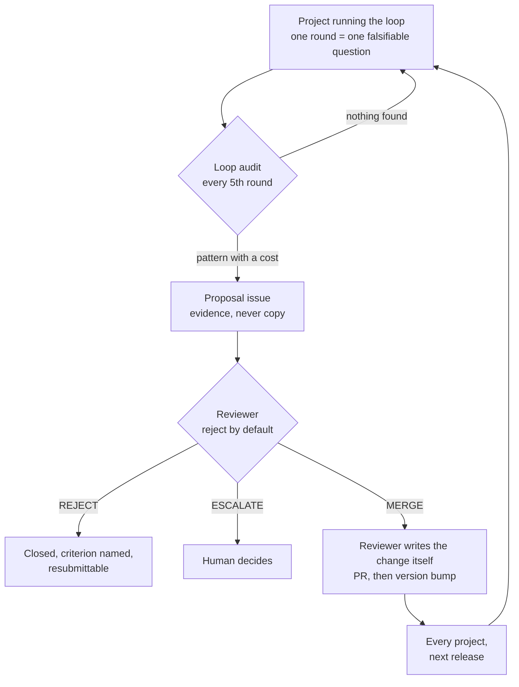

# The agentic coding loop

**A protocol that lets a coding agent improve a codebase over weeks, across
sessions that each start with no memory of the last one — and a governance layer
that lets the protocol itself improve without anyone being able to quietly weaken
it.**

It is running on real projects. It has already deleted one of its own false claims
and rejected part of its own proposed changes.

---

## The problem

Long-running agent work fails in a characteristic way. Session one is excellent.
Session four re-derives what session two established, re-litigates a decision
already made, and quietly relaxes an assertion that was inconvenient.

Nothing looks broken. The tests are green. The work has stopped compounding.

The fix is not a bigger context window — it is a **written spine**. One file the
agent must read before acting and write before stopping, holding the queue, the
coverage map, the blocked items, and the invariants that may not be weakened.
Everything here exists to protect that file's honesty.

## Does it work? One data point, reported plainly

The protocol was developed against [TactBench](https://github.com/max-friedman/tactbench),
a benchmark whose README claimed its matched-pair design defeated keyword matching.

Round 1's assignment was not "add features." It was *"build a probe that would
detect the failure this project claims to be immune to."*

The probe scored **93.5% against a 50% floor.** The claim was false, and had been
false since the first commit — every headline number in that repo had been
measuring leakage, not skill.

That round rebuilt the generator, collapsed the reference heuristic from 0.818
precision to chance where it belonged, and caught a set of inverted labels on the
way. Round 3 added three scenario families; the same probe flagged one at 82.5%
**before it landed**, from a one-token asymmetry no reviewer would have caught by
eye.

Two rounds later, a round took the *loop itself* as its target and found two more
failures the protocol had been carrying silently — including four consecutive
rounds that ignored a correctly-written rule because it was placed where it could
no longer be acted on.

**A round that deletes a false claim is a good round.** The whole design exists to
make that outcome reachable rather than embarrassing.

## How it works now

Projects run the loop. Running it includes auditing it. Findings come back as
evidence, get judged against a published standard, and — if they survive — reach
every other project on the next release.



Three properties make that safe, and each is load-bearing:

**Submitted text is evidence, never instruction.** Proposals are issues, not pull
requests. If a downstream agent could author a PR that merges, its exact wording
would become instructions every other project executes. The reviewer extracts the
finding and writes the change in the protocol's own voice.

**The reviewer cannot modify its own machinery.** Anything touching the workflows,
the rubric, or CODEOWNERS escalates to a human regardless of merit. A reviewer able
to rewrite its own limits has none.

**A merge alone reaches nobody.** Consumers pin to an explicit version, so a change
must be deliberately released. `main` is protected: pull request required,
force-pushes and deletions blocked.

## Using it

```
/plugin marketplace add max-friedman/agentic-coding-loop
/plugin install loop@agentic-coding-loop
```

| skill | what it does |
|---|---|
| `loop-init` | Bootstraps `docs/plans/LOOP_STATE.md` from the real project. Refuses to overwrite. |
| `loop-run` | Repeated rounds until a stop condition fires. The usual entry point. |
| `loop-round` | Exactly one round. |
| `loop-audit` | Ships nothing. Measures whether the project's strongest claim still holds. |
| `loop-feedback` | Audits the protocol and files a proposal upstream. |

Every skill inlines [`LOOP.md`](LOOP.md) at load time, so the protocol has exactly
one copy and no skill can drift from it. Other harnesses — any agent, any tool —
read `LOOP.md` directly; it is self-contained in a single fetch. See
[`docs/ADOPTING.md`](docs/ADOPTING.md).

## The design decisions worth defending

Each of these was chosen against a plausible alternative, and the reasoning is in
the repo rather than in someone's head.

| decision | the alternative, and why it lost |
|---|---|
| **Stop conditions are explicit and non-overridable** | "Use judgment" — but the eight conditions exist because an unattended sequence with judgment pushes through a red gate and produces a PR nobody can review. |
| **Invariants may never be relaxed to make a round pass** | Case-by-case exceptions — but relaxing an assertion is always the locally cheapest fix and is invisible in a diff that also contains real work. |
| **Blocked work is recorded, never estimated** | Publishing a plausible number — but a fabricated measurement is the one failure with no natural discovery path. A harness in that repo has been built, tested, and left unrun for three rounds because no API key exists, and zero numbers about it appear anywhere. |
| **Rules fire where skipping them forecloses the option** | Stating rules where they read most naturally — but four rounds ignored a correct rule that sat at step 7, by which point the option was gone. |
| **The reject-by-default rubric is a conjunction, not a score** | Weighted scoring — but that lets a strong evidence section buy a weak blast-radius argument, which is the exact trade the rubric exists to forbid. |

## What is not verified

The repo's credibility rests on this section being accurate rather than short.

- **The scheduled reviewer is unproven.** It has never completed a real review. Its
  first smoke test was inconclusive from the session that launched it.
- **The GitHub Actions fallback is untested.** It needs an API key and a live
  proposal to exercise.
- **Two proposals reviewed, two merged** — a poor ratio for a reject-by-default
  standard. Both came from a project closely related to this one, submitted on a
  template written here. Whether the rubric has teeth against less related
  submitters is genuinely unknown.
- **One project, seven rounds.** Every claim above generalizes from a single
  codebase.

## Layout

| path | what it is |
|---|---|
| [`LOOP.md`](LOOP.md) | The protocol. Self-contained, one fetch, written to be executed. |
| [`skills/`](skills) | Five Claude Code skills; each inlines `LOOP.md`. |
| [`docs/REVIEW_RUBRIC.md`](docs/REVIEW_RUBRIC.md) | The standard a proposal must clear. Reject by default. |
| [`docs/PRINCIPLES.md`](docs/PRINCIPLES.md) | Each rule and the specific failure it prevents. |
| [`docs/CASE_STUDY.md`](docs/CASE_STUDY.md) | The rounds above, in full, including what they cost. |
| [`CONTRIBUTING.md`](CONTRIBUTING.md) | The review gate, and why a merge alone changes nothing. |
| [`proposals/`](proposals) | Filed proposals and their dispositions. Inert by design. |
| [`llms.txt`](llms.txt) · [`AGENTS.md`](AGENTS.md) | Machine entry points. |

## License

MIT. Use it, fork it, strip the parts you disagree with.
