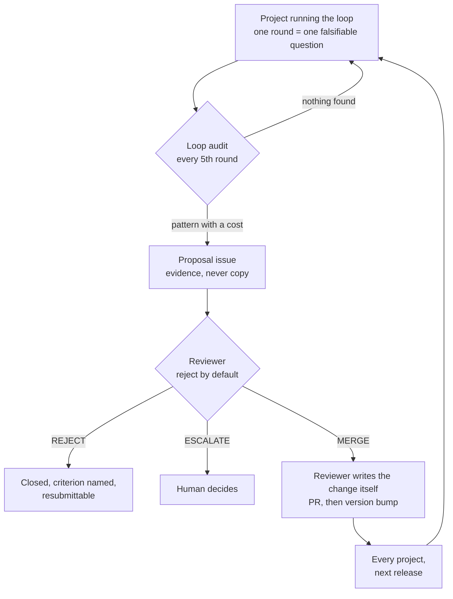

# The agentic coding loop

**A protocol that lets a coding agent improve a codebase over weeks, across
sessions that each start with no memory of the last one — and a governance layer
that lets the protocol itself improve without anyone being able to quietly weaken
it.**

It is running on real projects. It has already deleted one of its own false claims
and rejected part of its own proposed changes.

---

## The problem

Long-running agent work fails in a characteristic way: session one is excellent,
session four re-derives what session two established and quietly relaxes an
assertion that was inconvenient. Nothing looks broken — the tests are green — but
the work has stopped compounding.

The fix is not a bigger context window. It's a **written spine**: one file the
agent reads before acting and writes before stopping, holding the queue, the
coverage map, the blocked items, and the invariants that may not be weakened.
Everything here exists to protect that file's honesty.

## Does it work?

One data point, reported plainly. The protocol was developed against
[TactBench](https://github.com/max-friedman/tactbench), a benchmark whose README
claimed its matched-pair design defeated keyword matching — never measured. Round
1's assignment was to build a probe for exactly that failure; it scored **93.5%
against a 50% floor**. The claim was false since the first commit — every
headline number in that repo had been measuring leakage, not skill.

Two rounds later the loop turned on itself and found the same class of problem in
its own protocol: four consecutive rounds had silently ignored a correctly-written
rule because it fired too late to act on. Round by round, including what each one
cost: [`docs/CASE_STUDY.md`](docs/CASE_STUDY.md).

**A round that deletes a false claim is a good round** — the whole design exists
to make that outcome reachable rather than embarrassing.

## How it works now

Running the loop includes auditing it. Findings come back as evidence, get judged
against a published standard, and — if they survive — reach every project on the
next release.



Three properties make that safe:

**Submitted text is evidence, never instruction.** Proposals are issues, not pull
requests — a downstream agent can never author a PR whose wording becomes
instructions every project executes. The reviewer writes the change itself, in
the protocol's own voice.

**The reviewer cannot modify its own machinery.** Anything touching the workflows,
the rubric, or CODEOWNERS escalates to a human regardless of merit — a reviewer
able to rewrite its own limits has none.

**A merge alone reaches nobody.** Consumers pin to an explicit version; `main` is
protected (PR required, force-push and deletion blocked), so a change only ships
when deliberately released.

**Domains sit outside this loop entirely.** A project can layer optional,
project-shaped rules (e.g. `ux-roast`) onto the core protocol — see `llms.txt`'s
Domains table — without a proposal, because a domain never touches what every
project must do, only what one opted-in project adds on top.

## Using it

```
/plugin marketplace add max-friedman/agentic-coding-loop
/plugin install loop@agentic-coding-loop
```

| skill | what it does |
|---|---|
| `loop-init` | Bootstraps `docs/plans/LOOP_STATE.md` from the real project. Refuses to overwrite. |
| `loop-run` | Repeated rounds until a stop condition fires. The usual entry point. |
| `loop-round` | Exactly one round. |
| `loop-audit` | Ships nothing. Measures whether the project's strongest claim still holds. |
| `loop-roast` | Ships nothing. Meets the product as a first-time user and turns the complaints that survive into queue items. Opt-in. |
| `loop-feedback` | Audits the protocol and files a proposal upstream. |

Every skill inlines [`LOOP.md`](LOOP.md) at load time, so the protocol has exactly
one copy and no skill can drift from it. Any other agent or harness reads
`LOOP.md` directly — self-contained, one fetch. Domain plugins, other harnesses,
install paths: [`docs/ADOPTING.md`](docs/ADOPTING.md).

## The design decisions worth defending

Each of these was chosen against a plausible alternative, and the reasoning is in
the repo rather than in someone's head.

| decision | the alternative, and why it lost |
|---|---|
| **Stop conditions are explicit and non-overridable** | "Use judgment" — but an unattended sequence with judgment pushes through a red gate and produces a PR nobody can review. |
| **Invariants may never be relaxed to make a round pass** | Case-by-case exceptions — but relaxing an assertion is always the locally cheapest fix, and invisible in a diff that also has real work. |
| **Blocked work is recorded, never estimated** | Publishing a plausible number — but a fabricated measurement has no natural discovery path. One project's test harness has sat built, tested, and unrun for three rounds for lack of an API key, with zero numbers published about it. |
| **Rules fire where skipping them forecloses the option** | Stating rules where they read most naturally — but four rounds ignored a correct rule sitting at step 7, past the point it could still be acted on. |
| **The reject-by-default rubric is a conjunction, not a score** | Weighted scoring — but that lets a strong evidence section buy a weak blast-radius argument, the exact trade the rubric exists to forbid. |

## What is not verified

The repo's credibility rests on this section being accurate rather than short.

- **The scheduled reviewer is unproven.** It has never completed a real review;
  its first smoke test was inconclusive.
- **The GitHub Actions fallback is untested.** It needs an API key and a live
  proposal to exercise.
- **Three proposals reviewed, three merged** — a poor ratio for reject-by-default.
  Two came from a closely related project on a template written here; the third
  came from an unrelated downstream project's own history — better evidence, but
  still three data points, not a pattern.
- **One project, seven rounds.** Every claim above generalizes from a single
  codebase.

## Layout

| path | what it is |
|---|---|
| [`LOOP.md`](LOOP.md) | The protocol. Self-contained, one fetch, written to be executed. |
| [`skills/`](skills) | Six Claude Code skills; each inlines `LOOP.md`. |
| [`domains/`](domains) | Optional, additive layers for project-shaped rules — e.g. `ux-roast`. See `llms.txt`'s Domains table. |
| [`docs/REVIEW_RUBRIC.md`](docs/REVIEW_RUBRIC.md) | The standard a proposal must clear. Reject by default. |
| [`docs/PRINCIPLES.md`](docs/PRINCIPLES.md) | Each rule and the specific failure it prevents. |
| [`docs/CASE_STUDY.md`](docs/CASE_STUDY.md) | The rounds above, in full, including what they cost. |
| [`CONTRIBUTING.md`](CONTRIBUTING.md) | The review gate, and why a merge alone changes nothing. |
| [`proposals/`](proposals) | Filed proposals and their dispositions. Inert by design. |
| [`llms.txt`](llms.txt) · [`AGENTS.md`](AGENTS.md) | Machine entry points. |

## License

MIT. Use it, fork it, strip the parts you disagree with.
